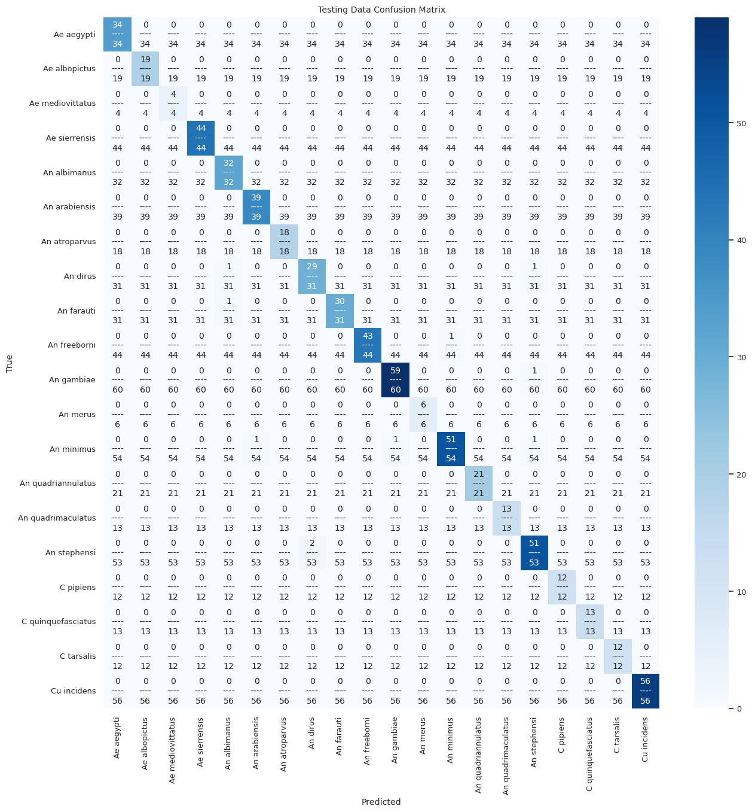

# Classification-of-Mosquito-Species-Using-Wingbeat-Frequencies-from-Mobile-Phone-Recordings
Classification of Mosquito Species Using Wingbeat Frequencies from Mobile Phone Recordings

In this study, I utilized the dataset from Stanford University with wing-beat recordings from 20 species, collected via mobile phones in diverse environmental conditions. By employing robust pre-processing techniques and the DenseNet121 model—known for its densely connected convolutional layers that enhance feature reuse and gradient flow. Achieved over 98% prediction accuracy.

## Testing Data Confusion Matrix

